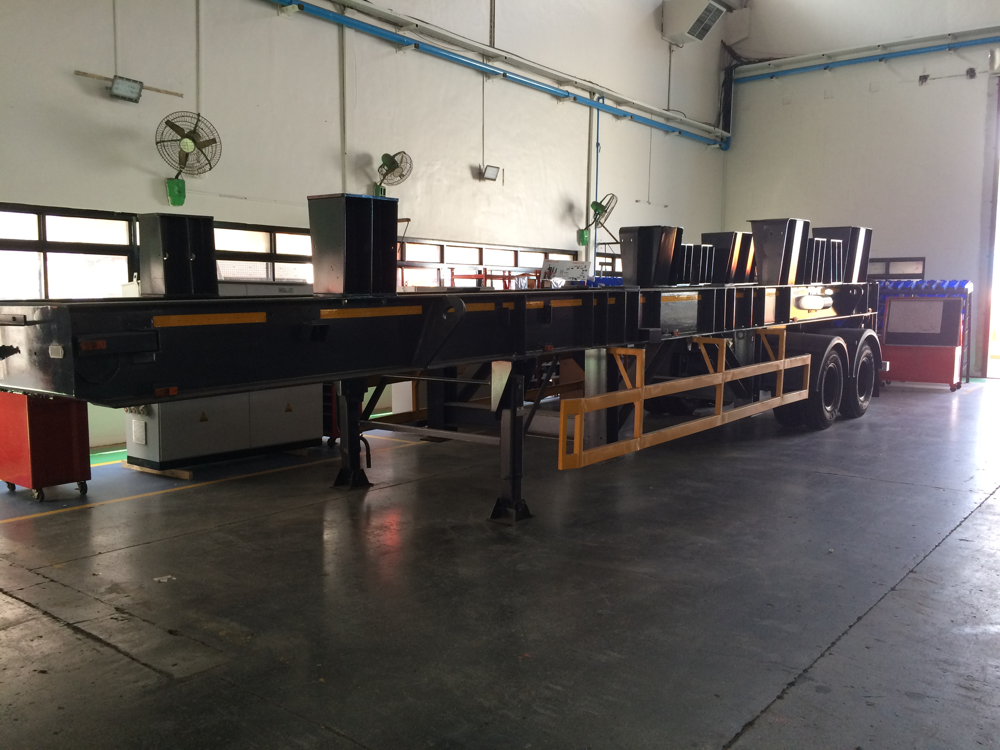
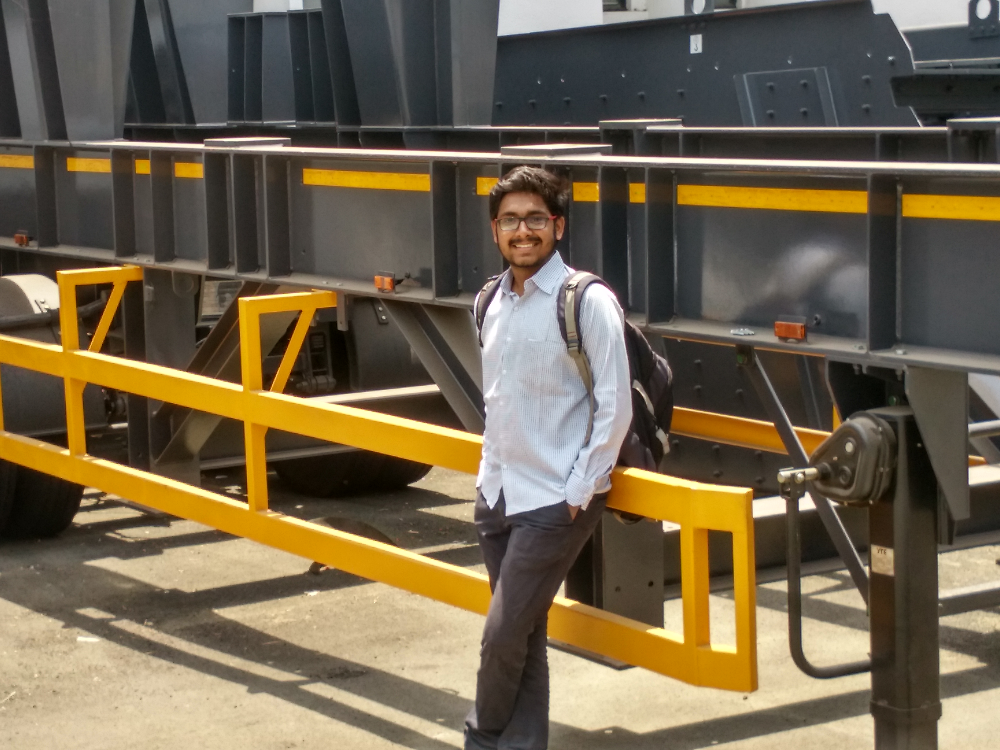

# Design-Analysis-Manufacturing-of-Multi-Utility-Trailer
•Under-Graduation final year project sponsored by 'Sandvik Asia Private Limited', Pune, MH, India. • Successfully designed &amp; manufactured a ‘Multi–Utility Trailer’ to carry payloads up to maximum 30 tons having varied dimensions and weight distribution. 

# Final Trailer

#

